# ptpy-rs

A Python REPL demo using [`ruff`](https://github.com/astral-sh/ruff) APIs to parse & highlight, written in Rust.


## Install
``` sh
pip install ptpyrs
```
Then you can replace `python3` by `ptpyrs`, for both interactive mode and executing mode.

## Develop

``` sh
maturin develop
```

## Reference
[ptpython](https://github.com/prompt-toolkit/ptpython): A better Python REPL